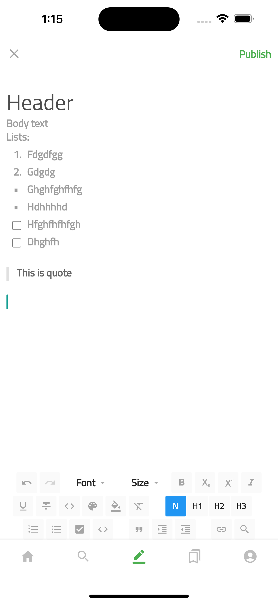

# Hebr

App like medium.

## Description

- Feature based architecture
- Firebase auth.
- Hydrated bloc for offline storage

  
[Watch a video](https://drive.google.com/file/d/1f5QFSa-MKwZP9G5CwPOlgPzyiJhQuQuK/view?usp=sharing)
  

#### Screenshots

<table>

<tr>
 <td style="text-align: center, width: 180">
   
   Home
  </td>

   <td style="text-align: center, width: 180">
   
   Login
  </td>

  <td style="text-align: center, width: 180">
   
   Publish
  </td>
</tr>

<tr>
 <td style="text-align: center, width: 180">
   
   Profile
  </td>

   <td style="text-align: center, width: 180">
   
   Search
  </td>
</tr>
</table>

